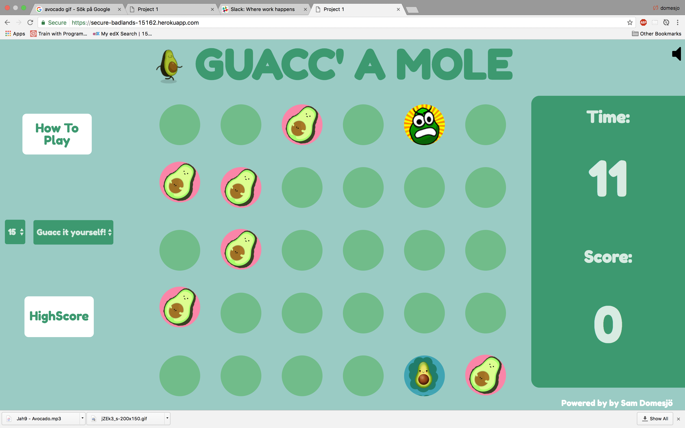

# Guacc' A Mole'

###GA WDI25 London - Project 1

#### Whack a Mole with a fruity twist

This is a singleplayer game with a online highscore so you can compete with your friends! There is multiple options of how you wanna play.

#####[Play it here!](https://secure-badlands-15162.herokuapp.com/)

#####Rules

1.Select options to play with such as time and difficulty level.

2.Click the Avocados with a core to gain either 1 or 2 points.

3.Don't click the angry Avocado

4.Read the How To Play!

####Approach / How it works
Just like in the classic "Whack a mole" Theme park arcade game, you are suppose to click on the appearing avocados in order to get points under a certain amount of time. It will also appear avocados that will give you minus points if clicked.
It is a highscore saved in the localstorage to keep the game competetive.

Most of the actual game is created in Jquery, and the generator of where the "Moles" appear are randomly generated over the board.
Since the game can be quite quick there will be a "cash machine sound" to confirm if you hit the mole.

####The build

* HTML 5, CSS/SASS and jQuery were used to create this game. 
* The Font-Awesome Fonts and the google Font ("Fredoka One")
* The Audio is playing from a trigger with Jquery, and a autoplay song(Avocado). 
* 

#### Problems & Challenges

The main challange with building this game was the styling, it is really easy to put everything on display and make they UI confusing. The random generator of the moles appear is a problem since you never know how many moles it's gonna be per round. Which makes the game unpredictable, but also gives it a charm,finding the balance was definetly a challenge.

